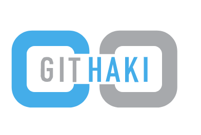

# git-haki@1.0.0

A simple way to add git hooks. 
Hooks enable team to only push quality code. Haki makes it easier to create hooks.

>Git-haki is a simple node module  which can be leveraged for git hooks to achieve automation of build tasks with code commit and push.
It is not task runner specific and expects simple configuration with hook name and tasks needs to be run with that hook.

Advanatage of git-haki over existing hooks:

>1)pre-commit:-

    pre-commit hooks runs while you commit the code.It will run the tasks on the entire code base 
    but it will not check for staged or unstaged files.
    If the fixes or buggy code in unstaged files,it will leads to buggy code in Dev branch.

    To avoid this,git-haki will ask user to commit all the code i.e, all the code changes should be staged 
    and there should not be any unstaged files.
    So,that tasks run on proper code base in achieving error free code commit in to the branch.

>2)pre-push:-

    pre-push hooks runs while you push the code.It will run the tasks on the entire code base
    but it will not check for staged or unstaged files.
    If the fixes or buggy code in staged/unstaged files,it will leads to buggy code in Dev branch.

    To avoid this,git-haki will ask user to commit all the code i.e,
    all the code changes should be staged and committed.There should not be any staged/unstaged files before push.
    
    So,that tasks run on proper code base in achieving error free code push in to the branch.

## Installation

> npm install git-haki --save-dev

This will install the git-haki as devdependencies.

## Usage

To use

> const GitHaki = require('git-haki');

create a gulp/grunt task with task runner and use the following code and run the task once.

> GitHaki({
>    name: 'pre-commit',
>    command: 'npm test',
>    bashDest: "Relative path to '.git/hooks' directory" // by default it would take '.git/hooks' in root directory if not given
>});

This will create pre commit git hook which will run npm test script specified in your projects package json.

If you want to to update the command with adding or modifying the tasks,you need to run the grunt/gulp task again to update the hooks.

## Limitation

Supports only pre-commit and pre-push git hooks 

## Future

Will add support for
- Other git hooks
- Run from command line with configuraion file and options
- Logging issues

## How can you help
- Please log issues or feature requests
- Create PRs with feature request by forking repo (raise PR only to DEVELOP branch)
- Help in creating and improving documentation
